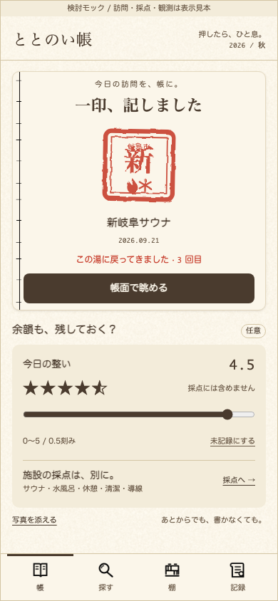
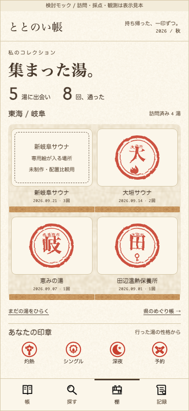
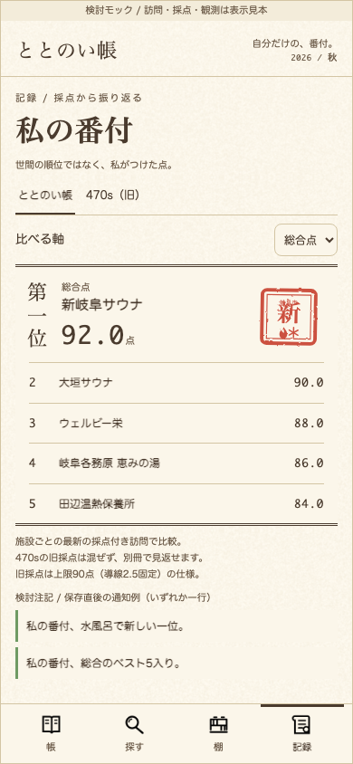
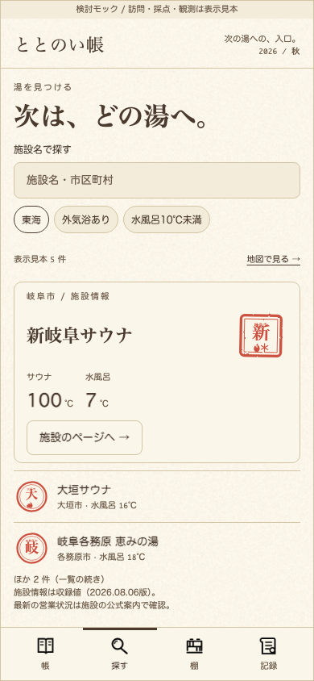
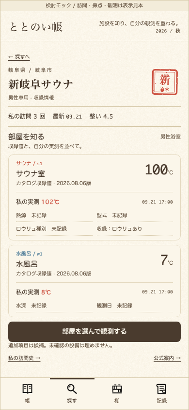

# ととのい帳 / 五つの仕事

2026-09-21 · チャッピー · **検討モック、未承認・本体未実装**

依頼: [Issue #24 / 5757788451](https://github.com/Kirin1009/SAUNA30/issues/24#issuecomment-5757788451)

## 見るもの

- [HTML原本](index.html): 5画面を並べて比較。ローカルでそのまま開けます。
- PNG: 各 **390×844 / DPR 1**。端末枠は付けていません。
- `tokens.css`: デザイン憲法v1.2の値をそのまま使用。
- `mock.css` / `mock.js`: このモックだけの描画・操作見本。
- `existing-seals.js`: 現行 `facSeal()` / `sealBadges()` と実カタログ5施設のスナップショット。
- `prepare.mjs` / `verify.cjs`: 開発者向け再抽出・PNG再描画・検証。HTMLの閲覧にビルドや外部ライブラリは不要。

## 今回の判断

**施設の記憶は棚、採点の比較は記録。** 収集と順位を同じ画面の先頭で競わせず、仕事ごとに主役を決めました。見出しを明朝へ戻し、紙の色差と罫線で階層を作っています。朱は記録、操作は墨。今回は達成の場面ではないので金は使っていません。

### 01 押す / 完了が主役



- 明朝22: 「一印、記しました」。等幅: 日付・回数・整い値。朱: 既存判子と再訪記録。墨: 「帳面で眺める」。
- 現行の完了画面を維持し、その下に任意の「今日の整い」を追加。0〜5、0.5刻み。**0点と未記録は別**。施設の5軸採点と合算しません。
- 主操作は終了。採点は小さな導線に留め、自動では開きません。写真・整い・採点は後からでもよい構成です。
- 半星・スライダーは選択中のUIなので墨。朱や金の星にはしません。

### 02 棚 / 施設の印が主役



- 明朝32: 「集まった湯。」。等幅32: 出会った湯・通った回数。朱: 判子と獲得印章。既存の `wood-back.webp` / `wood-shelf.webp` を再利用。
- 4列から2列へ変更し、「あなたの印章」を施設の下へ移動。獲得済み岐阜4湯を掲載、全体集計5湯には画面外の愛知1湯を含みます。
- 新岐阜サウナには「専用絵が入る場所」「未制作・配置比較用」を明示。他3施設は既存生成判子。施設名・訪問日・回数の位置と紙面の寸法を揃えました。
- **新しい絵は描いていません。今回評価できるのは混在時の配置・占有面積までです。完成絵と生成判子の密度・質感の相性は、承認画像受領後に要検証。** 実画なしで「違和感なし」とは結論づけません。
- 未訪問の絵は既定で出さず、「まだの湯をひらく」の後だけ見本として扱う提案。県のめぐり帳は明示opt-inのまま。

### 03 見返す / 私の番付



- 明朝32: 表題。明朝22: 第一位。等幅: 点数。順位は金で飾らず二重罫で格を作る。
- **記録タブに置く提案**。本体の時系列記録・編集・取り込みは維持する前提で、その横断的な見返し先を描きました。施設ごとの最新の採点付き訪問でベスト5を作る案です。
- 総合／サウナ／水風呂／休憩／清潔／導線を切替可能。総合は5軸合計×4、軸別は5点満点。この表示見本には特別加減点を入れていません。本体実装時は既存計算式を使用し変更しません。
- **旧採点は混ぜない案を採用**。「470s（旧）」を別冊として切り替え、行にも（旧）を付ける。上限90点・導線2.5固定を両表示で注記。再正規化や補間をしません。
- 最新記録の出典判定、同点時の扱い、直接採点し直した施設の旧履歴の扱いは実装前の設計事項。モックでは固定fixtureを用い、同点はid順です。母集団が5件未満でも空欄を課題として埋めさせません。
- 保存直後の通知は「新しい一位」「ベスト5入り」の2文案を比較用に併記。**同時に2件通知する仕様ではありません。** 旧採点は別母集団として判定し、初回母集団・同点・既存1位の再保存で通知を乱発しない設計が必要です。

### 04 探す / 名称から入る



- 明朝32: 主見出し、22: 先頭施設名。等幅: 温度。紙2: 検索欄。墨: 条件選択・施設への操作。
- 名称・市区町村検索を最上段に追加。条件と併用し、先頭施設を大きく見せる。既存の地図は別表示への入口を残します。
- 入力・外気浴・10℃未満フィルタ・0件表示を操作できます。検索対象はこの試作の**実在5施設だけ**。全文検索・alias・距離ソートの本体実装ではありません。
- GPSや架空の距離を使っていません。温度は収録カタログ値であり、現在の実測値とは扱いません。

### 05 施設ページ / 収録と観測を重ねる



- 明朝22: 施設名。等幅32: 部屋温度。緋／藍: 部屋の領域ラベル。朱: 自分の観測値。墨: 観測操作。
- サウナ室s1・水風呂w1それぞれに、収録温度・収録版と本人の実測・日時を分けて表示。どの部屋の情報か分かる密度にしました。
- 熱源・型式・水深・ロウリュ種別は**追加項目の候補**。未確認値はすべて「未記録」。施設の設備仕様を捏造していません。
- 「部屋を選んで観測する」を主操作に。どちらの部屋へ記録するかを先に選ぶ想定です。入力シート自体は今回の5カットに含みません。
- `100℃ / 7℃ / ロウリュあり` は保存済みカタログの男性浴室s1/w1由来。改装後の全設備を網羅した最新紹介ではありません。実測 `102℃ / 8℃` と日時は**架空の表示例**です。

## データ・素材の根拠

- 確認main: `7573a5d06d132ff80ae58442ffd043837b40ef61`（beta.7）。
- `docs/DESIGN-ととのい帳.md` v1.2。型スケール8段、明朝／丸ゴ／等幅、紙の階層、墨primary、朱と操作の分離、ナビ墨＋上罫を適用。
- `totonoi/index.html`: `facSeal()`、`sealBadges()`、`sealHash`、`esc`、共有 `#sealtex` を抽出。**判子関数は変更なし**。観測依存だけ `obsTemps=()=>[]` とし、利用者のデータを読まずカタログだけから判子を描画。
- `totonoi/catalog.js`: g4 新岐阜サウナ、g1 大垣サウナ、g2 岐阜各務原 恵みの湯、g5 田辺温熱保養所、a1 ウェルビー栄。棚の「恵みの湯」は短い表示名。追加二施設の専用絵の選定を意味しません。
- 既存スキン: `paper-page.webp`（基底面のみ）、`binding-left.webp`、`wood-back.webp`、`wood-shelf.webp`、4種タブ画像、獲得済みの家紋4種をマスクとして再利用。
- 日付・訪問数・採点・観測はすべてレイアウト確認用fixture。利用者の実データではありません。上部の検討帯は5枚すべてに表示します。
- 新規フォント取得・外部ライブラリ・新規画像生成なし。既存判子の色・書体リテラルだけは、関数同一性のため元のままです。

## 検品注記と実装の境界

`.proof-banner`、`.proof-notices` 内の「検討注記」、各図の外側のトークン／変更点の説明は、**製品UIではありません。移植禁止**。新岐阜の「専用絵が入る場所」も今回の比較用枠で、正式UIの文言ではありません。

ナビは5カット間を移動します。「帳」は今回範囲外のため押印完了カットへ移動。「帳面で眺める」・写真・採点・未訪問・めぐり帳・観測などは説明ダイアログのみで、保存やGPS処理はありません。HTMLを本体へそのまま移植しないでください。

帳の「非訪問日も最新の一印を主役に」は依頼コメントで確定済みですが、今回のカットと本体改修には含めていません。3印制作・追加二施設の選定・承認画像の受け渡し・10回の金常連判の分離は、別依頼待ちのままです。

## 再描画・検証

閲覧だけなら `index.html` を開くか、リポジトリを静的サーブしてください。単独カットは `index.html?cut=03-ranking` の形式です。

開発者向け（NodeとPlaywrightが利用できる環境）:

```sh
# 判子コード／カタログスナップショットの再抽出。元本更新時だけ実行。
node assets/totonoi/five-jobs/prepare.mjs

# 既存Playwrightのある環境。必要ならNODE_PATH / CHROMIUM_PATHを指定。
node assets/totonoi/five-jobs/verify.cjs
```

`prepare.mjs` は現在のチェックアウトから抽出します。別のmainで再抽出する場合は、元SHA・実測値・判子の同一性も再確認してください。再抽出は表示見本を作る補助であり、製品へのビルド工程追加ではありません。

今回の検証結果は `verification.json` に保存:

- Chromiumによる390×844のPNG5枚。全5カットで本文スクロールなしに比較内容が収まる。
- 320 / 375 / 414 / 768pxで横スクロールとボタンの文字はみ出しなし。狭幅では縦スクロール可。比較一覧も320〜1280pxで横溢れなし。
- 整い0・5・未記録、0.5刻み設定、採点と独立した操作。
- ベスト5の5行、軸変更で1位変更、旧採点切替・（旧）と90点注記。
- 名称検索、0件、外気浴条件を確認。
- 外部リクエスト0、console warning/error 0、localStorage/IndexedDBへの保存0。
- PNGを目視し、下端の印章と通知例がナビに隠れないよう修正済み。

**未検証**: 実機Safari、画像受領後の専用絵との相性、実データの移行・保存・順位判定。本体のコードと保存データは変更していません。
